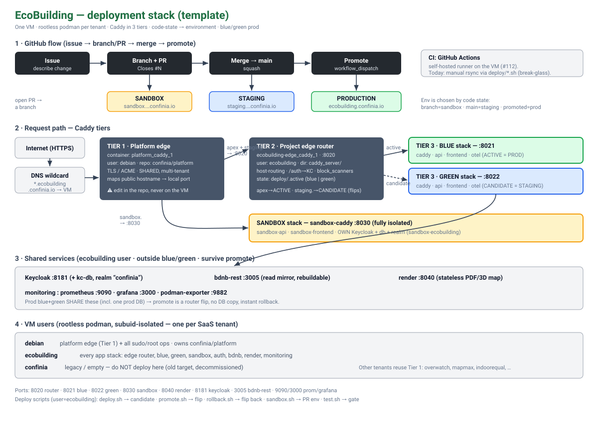

# STACK.md — Deployment architecture

> Reference description of how **Caddy**, **podman-compose**, and **VM user
> accounts** are organized to serve **sandbox** (PR branches), **staging/prod**
> (blue/green), and how **GitHub** (issues / PRs / Actions) drives it.
>
> This file is a **template**: every SaaS deployed on the shared VM should keep a
> `STACK.md` with the *same section headers* so they can be diffed and merged.



---

## TL;DR

- **One VM, many tenants.** Each SaaS = one **rootless podman user** (subuid-isolated). `ecobuilding` runs this product; `debian` owns the shared front door + sudo.
- **Caddy in 3 tiers.** A shared *platform edge* (TLS + hostname routing) → a per-project *edge router* (blue/green host routing) → per-stack caddy (frontend + api).
- **Environment = code state.** Branch/PR → **sandbox**, merged-to-`main` → **staging**, promoted → **production**.
- **Prod is blue/green.** Two stateless app stacks share one prod DB; *promote* is a router flip → zero downtime, instant rollback, **no DB copy**.
- **GitHub drives it.** Issue → branch → PR (`Closes #N`) → merge → promote. Target CI = GitHub Actions on a self-hosted runner; today deploys run via `deploy/*.sh` (rsync, break-glass).

---

## 1. Conventions

| Rule | Value |
|---|---|
| Isolation unit | one rootless podman **user** per SaaS tenant |
| Env ↔ code state | `sandbox` = branch/PR · `staging` = merged `main` · `prod` = promoted |
| Prod deploy | **blue/green** (two stacks, router flip) |
| Deployment contract | `docker-compose.yml` + `deploy/*.override.yml` (podman-compose) |
| Every change | tracked in GitHub (issue → branch → PR → merge → promote) |
| Docs / code | English (product/UI copy may be FR) |

---

## 2. VM users (rootless podman)

| User | Role |
|---|---|
| **`debian`** | Admin. Runs the **platform edge** (Tier 1) + all `sudo`/root ops. Owns the `confinia/platform` repo. Use `ssh debian` **only** when root is required. |
| **`ecobuilding`** | This SaaS. Runs **every** app stack: edge router, blue, green, sandbox, auth, bdnb, render, monitoring. All app ops target `ssh ecobuilding`. |
| **`confinia`** | Legacy/empty. **Do not deploy here** (old target, decommissioned). |
| others | `overwatch`, `mapmax`, `indoorequal`, … — other tenants, same pattern, sharing Tier 1. |

Each user has its own `~/.local/share/containers` store and subuid/subgid range, so tenants never collide.

---

## 3. Caddy — three tiers

**Tier 1 — Platform edge** (`platform_caddy_1`, user `debian`, repo **`confinia/platform`**)
Terminates TLS (ACME), and maps *public hostnames* → *local ports*. **Shared by all tenants.**
- `ecobuilding.confinia.io`, `staging.ecobuilding.confinia.io` → `127.0.0.1:8020`
- `sandbox.ecobuilding.confinia.io`, `sandbox.api.…` → `127.0.0.1:8030`
- ⚠ **Edit it in the `confinia/platform` repo, never on the VM** — a platform redeploy overwrites hand edits (see §10).

**Tier 2 — Project edge router** (`ecobuilding-edge_caddy_1`, user `ecobuilding`, dir `caddy_server/`, `:8020`)
Host-based routing to the active/candidate blue/green stack, plus shared concerns.
- apex `ecobuilding.confinia.io` → **ACTIVE** stack · `staging.…` → **CANDIDATE** stack
- `/auth/*` → shared Keycloak (`:8181`)
- `block_scanners` (403 on `/.env`, `/.git`, `/vendor/*`, `*.php`, …)
- State: `deploy/.active` = `blue|green`; installed config = `Caddyfile.<active>` (swapped on promote)

**Tier 3 — Per-stack caddy** (`ecobuilding-{blue,green}_caddy_1` on `:8021`/`:8022`, `sandbox-caddy` on `:8030`)
Intra-stack routing: static frontend + `/api` → the stack's FastAPI.

**Port map**

| Port | Service |
|---|---|
| 8020 | project edge router |
| 8021 / 8022 | blue / green stack entry |
| 8030 | sandbox stack entry |
| 8040 | render (headless PDF/3D map) |
| 8181 | Keycloak (shared auth) |
| 3005 | bdnb-rest (PostgREST read mirror) |
| 9090 / 3000 / 9882 | prometheus / grafana / podman-exporter |

---

## 4. Compose projects

| Project (`-p`) | Dir | Role | Lifecycle |
|---|---|---|---|
| `ecobuilding-blue` | `docker-compose.yml` + `deploy/blue.override.yml` | prod/staging app stack A | blue/green |
| `ecobuilding-green` | `docker-compose.yml` + `deploy/green.override.yml` | prod/staging app stack B | blue/green |
| `ecobuilding-edge` | `caddy_server/` | Tier-2 router | shared |
| `ecobuilding-auth` | `auth_stack/` | Keycloak + postgres | **shared, stateful** |
| `ecobuilding-sandbox` | `sandbox_stack/` | isolated PR env (own KC+db+realm) | always-on |
| `ecobuilding-bdnb` | `bdnb_stack/` | BDNB PostgREST read mirror | shared, rebuildable |
| `ecobuilding-render` | `render_stack/` | headless map renderer | shared, stateless |
| `ecobuilding-monitoring` | `monitoring_stack/` | prometheus/grafana/exporter | shared |

An **app stack** = `api` + `frontend` + `otel-collector` + `caddy`, all **stateless**. State lives only in the shared services.

---

## 5. Environments ↔ code state

| Env | Trigger | URL | Isolation |
|---|---|---|---|
| **sandbox** | open/updated **PR on a branch** | `sandbox.ecobuilding.confinia.io` | full — own Keycloak + db + realm (`sandbox-ecobuilding`) |
| **staging** | **merged to `main`** | `staging.ecobuilding.confinia.io` | today: the idle blue/green candidate (shares prod DB — see #111) |
| **production** | **promoted** | `ecobuilding.confinia.io` | the active blue/green stack |

`next.ecobuilding.confinia.io` is **retired** and must not exist.

---

## 6. Blue/green mechanics

- Blue and green are **identical, stateless** app stacks; only one is *active* (serving prod). The other is the *candidate* (serves staging).
- `deploy.sh` rebuilds + recreates the **candidate**, health-gates it on its local port, and never touches the active stack.
- `promote.sh` copies `Caddyfile.<candidate>` → `Caddyfile`, reloads the Tier-2 router, and writes `deploy/.active`. **Router flip only** — both stacks point at the *same* shared prod DB, so nothing is copied and rollback is instant (`rollback.sh` flips back).
- **No DB duplication on switch.** "Independent staging DB" (#111) is a *separate* concern from blue/green, not a conflict.

---

## 7. GitHub flow (issues / PRs / Actions)

```
Issue  ──▶  branch + PR (Closes #N)  ──▶  merge to main  ──▶  promote
   │              │                            │                 │
   │              ▼                            ▼                 ▼
   └── track   SANDBOX deploy            STAGING deploy      PRODUCTION
              (sandbox.*)               (staging.*)        (ecobuilding.*)
```

- Every change starts as an **issue**; work on a **branch**; open a **PR** referencing it.
- **PR prose** (issue/PR body, review, close comment) is approved by the operator before posting (RULES.md rule 11).
- **Target CI**: GitHub **Actions** on a **self-hosted runner** on the VM (deploys need the VM's rootless podman, unreachable from hosted runners) — tracked in **#112**. Until then, deploys run via `deploy/*.sh` from a workstation (documented break-glass).

---

## 8. Deploy scripts (`deploy/`, run as `ecobuilding`)

| Script | Does |
|---|---|
| `deploy.sh` | rsync working tree → build + recreate the **candidate** stack → health-gate → reload router |
| `promote.sh` | flip the router: candidate → **active** (prod) |
| `rollback.sh` | flip back to the previous active stack (instant) |
| `sandbox.sh` | deploy a branch to the isolated **sandbox** stack |
| `test.sh` | run the suite in a clean container (hermetic + opt-in e2e like `RENDER_E2E`) — the promotion gate |

---

## 9. PROS / CONS

**Pros**
- **Cheap & dense** — many SaaS on one VM, no per-tenant infra cost.
- **Strong isolation** — rootless podman per user; a tenant can't touch another's containers/store.
- **Zero-downtime + instant rollback** — blue/green is a router flip, no migration window.
- **No vendor lock-in** — plain compose + Caddy; reproducible; portable to any host.
- **Automatic TLS** — Caddy/ACME at the platform edge.
- **Auditable** — every change is an issue/PR; deploy state is a file (`deploy/.active`).

**Cons**
- **Single VM = SPOF** — no HA; one host reboot takes everything down.
- **Shared platform edge is cross-tenant coupling** — and a hand-edit footgun (§10).
- **Manual rsync deploys** until Actions lands (#112) — deploys depend on a workstation.
- **Staging shares the prod DB** today (#111) — not truly isolated.
- **Secrets in plaintext files** (`deploy/secrets.env`) — no vault/rotation.
- **podman-compose 1.3 quirks** — can't `--replace`; edge recreate needs a manual reload.
- **Thin observability** — no filesystem/uptime alerting wired to the project Prometheus.

---

## 10. Known gotchas / current issues

- **The platform edge is owned by `confinia/platform`, not this repo.** Hand-editing `~/projects/platform/caddy/Caddyfile` on the VM is reverted on the next platform redeploy. Register/rename hostnames **via a PR to `confinia/platform`**.
  - *Live example:* `staging.ecobuilding.confinia.io` is currently **broken** (TLS error) because a manual `next→staging` VM edit was reverted; the Tier-1 route still says `next.`. Fix belongs in `confinia/platform`.
- **rsync ships the working tree**, not just committed files (gitignored local files travel too). Keep the tree clean before `deploy.sh`.
- **`/tmp` is a 16 GB RAM-backed tmpfs** — never stage large files there (OOMs the VM).
- The VM's **`curl` truncates large response bodies to 0 bytes** — use Python/`httpx` to fetch PDFs/PNGs from the VM.

---

## 11. Expected improvements (standards & security)

**Standards / delivery**
- **CI/CD via GitHub Actions** + self-hosted runner; retire manual rsync (#112).
- **Dedicated staging stack with an independent DB** (#111) — true pre-prod isolation.
- **Platform edge as code** — hostnames added only by PR to `confinia/platform` (no VM hand-edits); ideally generated per-tenant from each `STACK.md`.
- **Automated backups + restore drills** for the stateful stores (Keycloak db, leads).

**Security**
- **Secrets management** — replace plaintext `deploy/secrets.env` with SOPS/age or a vault; rotate.
- **Least-privilege runner** — scope the Actions runner; keep secrets off it.
- **Image hygiene** — pin digests, scan images (Trivy), `dependabot`/SBOM, drop caps, read-only rootfs.
- **HA / SPOF** — managed or replicated prod DB; consider a second VM or failover for the apex.
- **Observability/alerting** — wire node-exporter + filesystem/uptime alerts to the project Prometheus.

---

## 12. Reuse as a template for the next SaaS

1. Create a rootless user `myapp`; assign a subuid/subgid range; pick a free **port block** (e.g. `81xx`).
2. Add its hostnames to Tier 1 **by PR to `confinia/platform`**: `myapp.confinia.io` + `staging.` → `127.0.0.1:<router>`, `sandbox.` → `127.0.0.1:<sandbox>`.
3. Clone the stack dirs: `auth_stack/` (own realm), `caddy_server/` (Tier-2 router), `docker-compose.yml` + `deploy/{blue,green}.override.yml`, `sandbox_stack/`.
4. Copy `deploy/*.sh` (set `HOST=myapp`) and this `STACK.md` (same headers).
5. `deploy.sh` → `promote.sh`. Then wire Actions (#112 pattern).

> **Merging tenants' STACK.md:** keep the section numbering/headers identical across projects; differences should reduce to the tables in §2–§5 (users, ports, compose projects, hostnames). That makes cross-project review and consolidation a diff.
